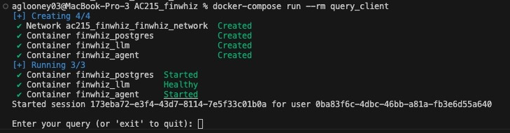
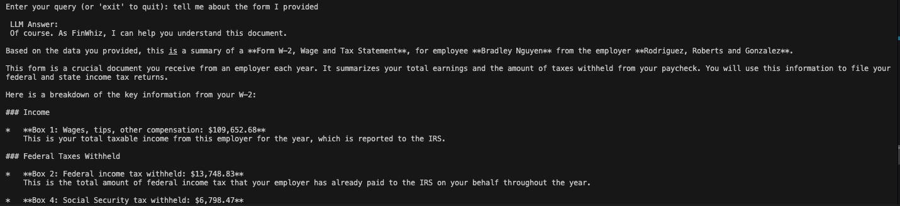
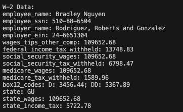
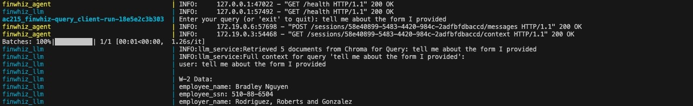

# Milestone 2 Report – FinWhiz

This report summarizes the artifacts delivered for **Milestone 2: MLOps Infrastructure**.

## 1. Infrastructure Overview

| Component | Status | Notes |
|-----------|--------|-------|
| Dockerized services | ✅ | `postgres`, `llm`, `agent`, `query_client`, `synthetic_data`, `webscraping`, `embedder`. |
| End-to-end pipeline | ✅ | `docker-compose up --build` .|
| Vertex AI integration | ✅ | LLM container uses `gemini-2.5-pro` |
| Chroma vector store | ✅ | Snapshot synced from GCS (`fw_ws/chroma_storage`). |
| Agentic user data | ✅ | W‑2 ingestion with auto-flatten, Postgres session store. |
| UI mock-up | ✅ | Clickable Figma prototype (link shared in stakeholder deck). |
| Environment screenshot | ⭕️ TODO | Capture Docker Desktop / terminal view showing running containers. |

## 2. How to Run the Pipeline

```bash
# from repo root
docker-compose up --build
# in a second terminal
bash test_full_pipeline.sh
```

See [`test_full_pipeline.md`](test_full_pipeline.md) for the output of running the test_full_pipeline.sh script

The script will:
1. Create a session (`POST /sessions/`).
2. Upload a synthetic W‑2 (`POST /sessions/<id>/w2`).
3. Log a user message (`POST /sessions/<id>/messages`).
4. Retrieve the combined agent context.
5. Query the LLM (`POST /query`).


## 3. Interactive Querying Session
```bash
docker-compose run --rm query_client
```
This creates a session for a user and allows you to input questions. An example output is below:





I then uploaded a mockup W-2 and asked the question: tell me about the form I provided





As you can see, it realized that I had uploaded a W-2 form and proceeds to provide information in that form such as my name and employer's name. Below is a printout of the W-2-specific context provided:




We can also look what each container is doing:




## 4. Mock-up / UI Status

- Figma prototype demonstrates the planned chat + upload experience.  
- Info icons and overlays explain how each UI event maps to backend calls (agent service, RAG retrieval).
- Link available here: https://www.loom.com/share/7a6db2fed5954eb58c788c617cd9e4f0?sid=2bc47a6f-3285-4c10-ac43-d63836c29e59.

## 5. Deliverables Checklist

- [x] Virtual environment & container setup instructions (root README + container READMEs).
- [x] Containerized RAG pipeline with documentation.
- [x] Logs proving end-to-end run (`test_full_pipeline.log`).
- [x] UI mock-up updated for Milestone 2.
- [ ] Screenshot of running environment (to be attached before submission).

## 6. Next Actions

1. Add support for more document types
2. Extend automated testing (integration tests for multiple document types).
3. Continue front-end build-out toward a thin working prototype.
